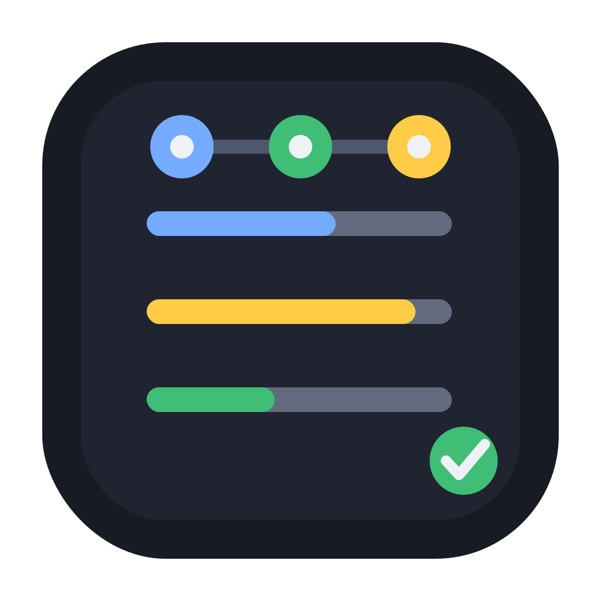

<p align="center">
  
</p>

<h1 align="center">Agent Usage</h1>

<p align="center">
  Track Codex, Claude, and Cursor subscription usage in one Chrome popup.<br />
  Local-only · No API keys · No backend
</p>

<p align="center">
  <a href="LICENSE"></a>
  <a href="extension/manifest.config.ts"></a>
  
</p>

---

## Install

You do **not** need Node.js or npm. Download a pre-built zip from [GitHub Releases](https://github.com/<your-org-or-username>/Agent-Usage-/releases), then load it in Chrome.

### 1. Download & unzip

Get `agent-usage-vX.Y.Z.zip` from Releases and unzip it somewhere permanent (for example `~/Apps/agent-usage`).

The folder you select in Chrome must contain `manifest.json` at the top level.

### 2. Load in Chrome

Open this URL in the address bar:

```text
chrome://extensions
```

Then:

1. Turn on **Developer mode** (top-right toggle)
2. Click **Load unpacked**
3. Select your unzipped folder

> Chrome will warn that the extension is not from the Web Store. That is normal for manual installs.

Optional: click the puzzle icon → pin **Agent Usage** to the toolbar.

### 3. Connect your accounts

1. Log in on each site in the **same Chrome profile** you use for the extension:
   - [cursor.com](https://cursor.com)
   - [chatgpt.com](https://chatgpt.com) (for Codex)
   - [claude.ai](https://claude.ai)
2. Open the extension popup → **Connect** on a card
3. Click **Import from browser session**

Done. Usage refreshes every ~60s while the popup is open, and every 5 minutes in the background.

---

## Supported providers

| | Provider | Usage shown |
|---|----------|-------------|
| 🖱️ | **Cursor** | Total, Auto + Composer, API % |
| 💻 | **Codex** | 5-hour & weekly limits (via ChatGPT login) |
| ✳️ | **Claude** | 5-hour & 7-day windows |

Numbers come from each vendor’s logged-in dashboard APIs — not official public APIs. If a site changes, an adapter may need an update.

---

## How it works

```text
Browser session (cookies)
        ↓
  Provider adapters  →  cursor.com / chatgpt.com / claude.ai
        ↓
  chrome.storage.local  (tokens + cached usage)
        ↓
  Popup UI
```

- **Adapters** (`extension/src/adapters/`) — one module per provider; fetches and parses usage JSON
- **Background worker** (`extension/src/background/`) — connect/disconnect, scheduled refresh every 5 min
- **Popup** (`extension/src/popup/`) — shows cached data first, then refreshes

Nothing is sent to a server run by this project. Requests go straight from your browser to the provider sites.

---

## Privacy & security

| | |
|---|---|
| **Storage** | Session tokens live in `chrome.storage.local` on your device only |
| **Passwords** | Never collected — uses existing browser sessions or pasted tokens |
| **Network** | Direct calls to provider domains; no proxy or analytics in v0.1 |
| **Disconnect** | Removes that provider’s stored credentials |

**Permissions used:** `storage`, `alarms`, `cookies`, plus host access to `cursor.com`, `chatgpt.com`, `claude.ai`, and `api.anthropic.com`.

Session tokens are as sensitive as being logged in. Do not share them or your extension folder with others.

---

## Manual connect

If **Import from browser session** fails, paste the cookie from DevTools → **Application** → **Cookies**:

| Provider | Cookie / token |
|----------|----------------|
| Cursor | `WorkosCursorSessionToken` |
| Codex | `__Secure-next-auth.session-token` or JWT `access_token` |
| Claude | `sessionKey` |

---

## Troubleshooting

| Problem | Fix |
|---------|-----|
| Session expired | Log in again on the site → **Import from browser session** |
| No session found | Same Chrome profile must be logged in; reload the tab and retry |
| Stale numbers | Click **↻** in the popup or reopen it |
| Extension frozen | `chrome://extensions` → reload **Agent Usage** |

---

## Development

For contributors building from source. Requires **Node.js 18+**.

**Clone & build**

```bash
git clone https://github.com/<your-org-or-username>/Agent-Usage-.git
cd Agent-Usage-/extension
npm install
npm run build
```

Load the output folder in Chrome:

```text
extension/dist
```

**Other commands**

```bash
npm run dev      # watch mode — rebuilds extension/dist
npm run icons    # SVG → PNG icons for the manifest
npm run lint     # ESLint
```

<details>
<summary><strong>Publish a GitHub Release (maintainers)</strong></summary>

```bash
cd extension
npm ci
npm run build
cd dist
zip -r ../../agent-usage-v0.1.0.zip .
```

Upload the zip to GitHub Releases. Bump `version` in `extension/manifest.config.ts` to match the tag.

</details>

<details>
<summary><strong>Project structure</strong></summary>

```text
extension/
├── manifest.config.ts    # Chrome MV3 manifest
├── src/
│   ├── adapters/         # cursor, chatgpt (Codex), claude
│   ├── background/       # service worker
│   ├── popup/            # React UI
│   ├── storage/          # credentials + usage cache
│   └── types/
├── scripts/
│   └── generate-icons.mjs
└── public/
```

</details>

---

## License

**Agent Usage** — [MIT License](LICENSE)

| Dependency | License | Notes |
|------------|---------|-------|
| React, Vite, @crxjs/vite-plugin | MIT | Shipped in the built extension |
| sharp | Apache-2.0 | Dev-only (icon generation); not in the release zip |

Icon asset: `extension/src/assets/agent-usage-icon.svg` — same MIT license as this repo.

Codex, Claude, Cursor, and ChatGPT are trademarks of their respective owners. This project is **unofficial** and not affiliated with OpenAI, Anthropic, or Cursor.

---

<p align="center">
  <sub>Usage APIs are reverse-engineered and may break without notice. Chrome unpacked install requires Developer mode.</sub>
</p>
